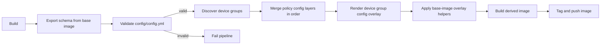

# Sikker Selvbetjening Config

Configuration and image-overlay repository for Sikker Selvbetjening.

This project defines device group specific configuration, renders normalized overlay data, and builds derived container images on top of the shared base image.

## Purpose

The repository is responsible for:

- Declaring per device group configuration in a structured format
- Validating configuration against shared schemas
- Rendering an overlay payload for each device group
- Applying overlays with helper tooling from the base image
- Building and publishing device group specific images

## How it works

1. Build orchestration runs in .github/workflows/build.yml.
2. Schema export reads BASE_IMAGE at BASE_IMAGE_SCHEMA_PATH and writes .ci/schema.json (.github/workflows/build.yml).
3. Config validation checks config/config.yml against .ci/schema.json (.github/workflows/build.yml).
4. Build device group discovery reads config/config.yml (scripts/discover-device-groups.py).
5. Policy configuration layers are combined in their respective order using the selected device group definition from config/config.yml (playbooks/render-host-overlays.yml).
6. Emit combined configuration for base-image playbooks (playbooks/render-host-overlays.yml).
7. Base-image overlay helpers transform data into concrete filesystem changes using config/assets/* and build/<image>/* (scripts/build-device-group-image.sh).
8. The derived image is built, tagged, and pushed (scripts/build-device-group-image.sh).

## Repository structure

- config/
	- Configuration input for device groups and environments
- playbooks/
	- Rendering and operational playbooks
- scripts/
	- Local and CI helper scripts for validation and image builds
- templates/
	- Reusable template fragments used during render steps

## Validation model

Validation is done in two layers:

- Schema validation: configuration is validated against the shared schema contract.
- Logical validation: additional checks ensure internally consistent settings before build.

The schema contract is sourced from the base image, which keeps configuration validation aligned with runtime expectations.

## Build and release

The image build flow is device group-oriented and designed for CI matrix execution:

- Render device group overlay into a build directory
- Apply helper-driven transformations from the base image
- Build derived image
- Tag and push to registry

Tags typically include latest and immutable identifiers (for example date and commit-derived tags).

## Relationship to the base image

This repository depends on the base image in two important ways:

- It reads schema definitions from the base image to validate configuration.
- It runs base-image overlay helper tools to materialize final filesystem changes.

This makes schema locations and helper interfaces a compatibility boundary between the two repositories.

## Typical usage

Use this repository when you need to:

- Build a configuration-specific image for one or more device groups
- Validate configuration changes before publishing
- Produce reproducible overlays for deployment pipelines

## Development notes

- Prefer small, incremental configuration changes per device group.
- Run validation before building and pushing images.
- Keep render logic deterministic so CI and local runs produce identical output.
